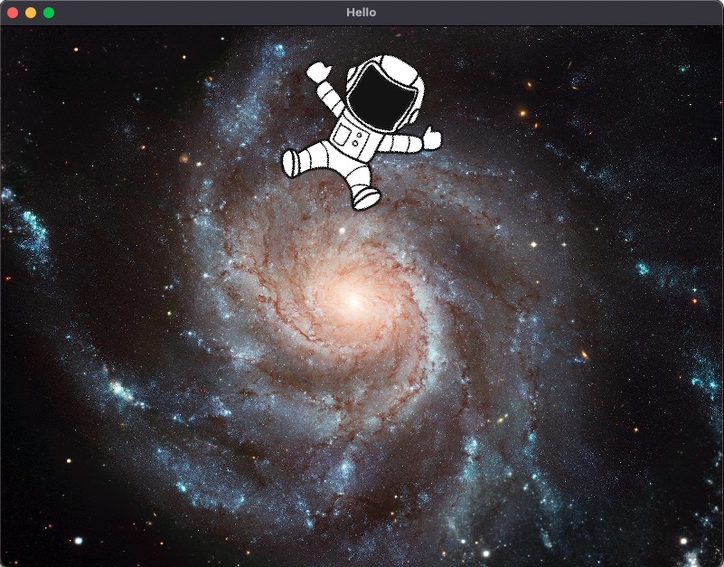

# Ebitengine Astronaut

This is a simple Go program that uses the [Ebitengine](ebitengine.org) game engine to display an astronaut bouncing around the window.

It is deployed online [here](https://ebitengine-astronaut.vercel.app)



## Usage

To run the program, execute the following command from the repository root:

```
cd src && go run main.go
```
